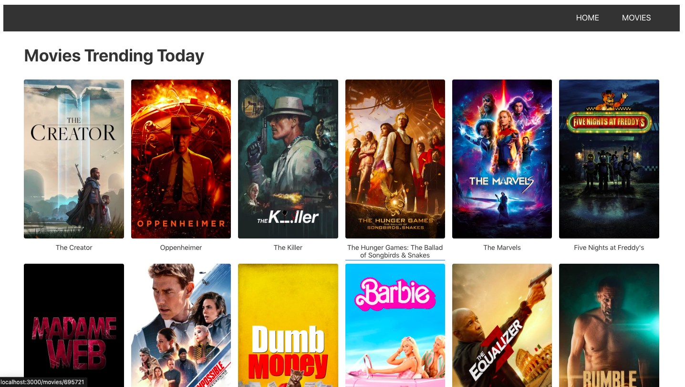
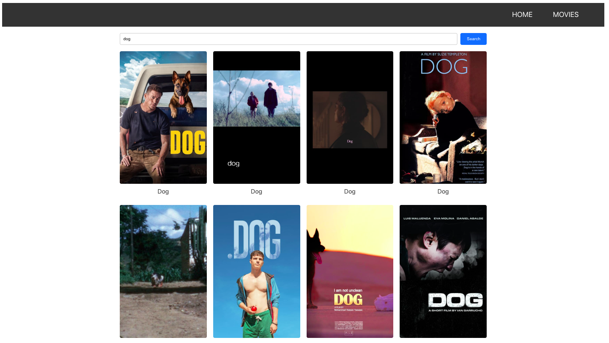

# Movie Search and Details Application

This project is a basic routing setup for an application designed for searching
and saving movies. The application utilizes the themoviedb.org API to fetch
trending movies, search for movies based on keywords, and retrieve detailed
information about specific movies.

## Components Overview

- **Home**: Displays a list of trending movies.

- **Movies**: Allows users to search for movies using keywords.

- **Movie details**: Provides detailed information about a specific movie,
  including cast and reviews.

- **Cast**: Displays information about the cast of a movie

-**Reviews**:Shows reviews for a movie

## Preview




## Installation

To run the Phonebook application locally, follow these steps:

1. Clone the repository:

   ```bash
   git clone [repository-url]

   ```

2. Change to the project directory:

   ```bash
   cd [repository-name]

   ```

3. Install and start dependencies:
   ```bash
   npm install
   npm start
   ```

The application should now be accessible in your web browser at
http://localhost:3000.

## How it works

The main component is App, defined in App.jsx. The application uses
themoviedb.org API endpoints to fetch trending movies, search for movies, and
get detailed information about specific movies.

## Routes

1. /: Home page with a list of trending movies.
2. /movies: Search page for movies based on keywords.
3. /movies/:movieId: MovieDetails page with detailed information about a
   specific movie.
4. /movies/:movieId/cast: Cast page with information about the cast .
5. /movies/:movieId/reviews: Reviews page with information about movie reviews.

## Code Splitting.

The application implements code splitting for asynchronous loading of JS code
using React.lazy() and Suspense>.
